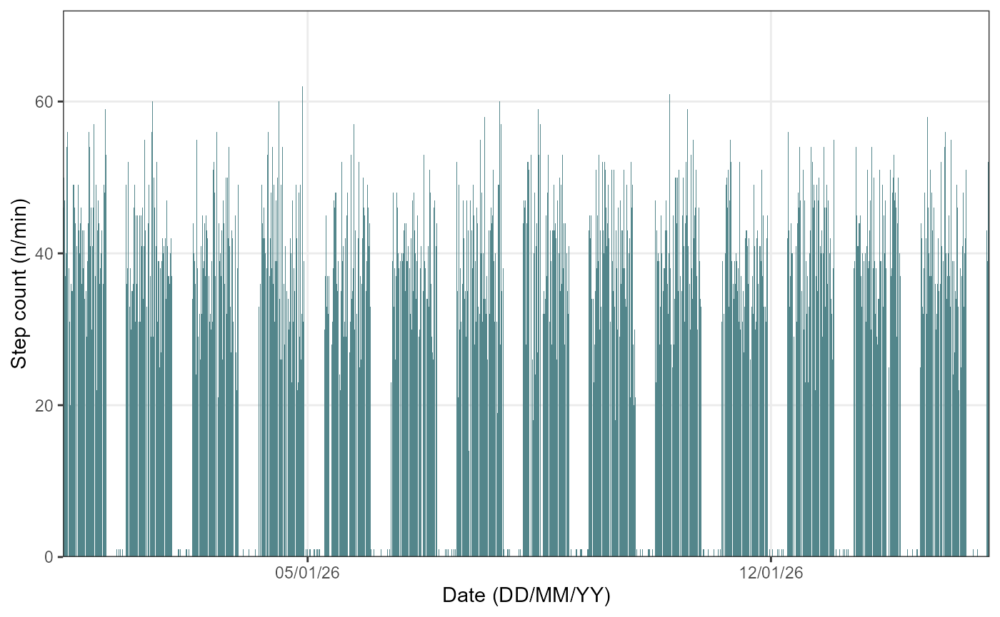

# Physical Activity Data

## 1. Introduction

The `hypometrics` package was built to handle physical activity and
sleep data generated by the FitBit Charge 4. Future work will consist of
augmenting the package’s adaptability in order to read in data from
different Fitbit devices or other activity and sleep trackers
(e.g. Garmin).

This article describes the step count and heart rate specific functions
that were created as part of the `hypometrics` package.

### Setup

To be able to use the step count and heart rate functions, firstly
install and load `hypometrics`.

    #Install
    install.packages("remotes")
    remotes::install_github("leicester-cdag/hypometrics")

``` r
#Load package
library(hypometrics)
```

### Simulated data

Throughout this tutorial, the examples presented will be based on the
[`raw_step`](https://leicester-cdag.github.io/hypometrics/reference/raw_step.html)
and
[`raw_hr`](https://leicester-cdag.github.io/hypometrics/reference/raw_hr.html)
datasets.

- A preview of the `raw_step` dataframe is shown below:

``` r
utils::head(raw_step)
#>    id      step_timestamp count
#> 1 P01 2026-01-01 07:17:00    35
#> 2 P01 2026-01-01 07:18:00    38
#> 3 P01 2026-01-01 07:19:00    52
#> 4 P01 2026-01-01 07:20:00    44
#> 5 P01 2026-01-01 07:21:00    17
#> 6 P01 2026-01-01 07:22:00    46
```

- A preview of the `raw_hr` dataframe is shown below:

``` r
utils::head(raw_hr)
#>    id        hr_timestamp heart_rate
#> 1 P01 2026-01-01 07:17:00         63
#> 2 P01 2026-01-01 07:18:00         65
#> 3 P01 2026-01-01 07:19:00         72
#> 4 P01 2026-01-01 07:20:00         68
#> 5 P01 2026-01-01 07:21:00         55
#> 6 P01 2026-01-01 07:22:00         69
```

## 2. Reading activity data

The function
[`activityRead()`](https://leicester-cdag.github.io/hypometrics/reference/activityRead.md)
allows the user to read and combine raw activity files downloaded
directly from their Fitbit account. If the downloaded folder is zipped,
there is the option to unzip the folder by setting the `Unzip` argument
to TRUE. This will create a new folder in the selected `Folder Path`
called `Unzipped Fitbit`. The Fitbit file type to read must be specified
using the `FileType` argument, either json or csv. As the individual
files do not contain personal identifiers, it might be useful to add an
ID column across the files to easily identify participants. It is
possible to do this using the `StudyID` argument of the function.

Syntax examples are shown below:

``` r
hypometrics::activityRead(Unzip = F,
                          FolderPath = "C:/Users",
                          FileType = "json",
                          FilePattern = "steps-",
                          StudyID = "P02")

hypometrics::activityRead(Unzip = F,
                          FolderPath = "C:/Users",
                          FileType = "csv",
                          FilePattern = "active zone minutes",
                          StudyID = "P01")
```

## 3. Visualising activity data

It may be useful to plot activity data to visually inspect step count
and heart rate over time. The
[`activityVisualise()`](https://leicester-cdag.github.io/hypometrics/reference/activityVisualise.md)
function allows you to do this at three different levels of granularity.

### Overall

Using the default function parameters, you will obtain an overview of
activity data for the entire study period for a selected participant.
Data type must be specified using the `DataType` argument and can either
be `stepcount` or `heartrate`.

To visualise step count data, the following syntax is used:

``` r
hypometrics::activityVisualise(DataFrame = raw_step,
                               DataType = "stepcount",
                               StudyID = "P01")
```



  

To visualise heart rate data, the following syntax is used:

``` r
hypometrics::activityVisualise(DataFrame = raw_hr,
                               DataType = "heartrate",
                               StudyID = "P01")
```

### Week by week

It is also possible to view activity data on a weekly basis by
specifying a breakdown by week using the `TimeBreak` argument of the
function and which week is of interest using the `PageNumber` argument.

To visualise step count data, the following syntax can be used:

``` r
hypometrics::activityVisualise(DataFrame = raw_step,
                               DataType = "stepcount",
                               TimeBreak = "week",
                               PageNumber = 1,
                               StudyID = "P01")
```

  

To visualise heart rate data, the following syntax can be used:

``` r
hypometrics::activityVisualise(DataFrame = raw_hr,
                               DataType = "heartrate",
                               TimeBreak = "week",
                               PageNumber = 1,
                               StudyID = "P01")
```

  

The number at the top of the figure indicates the week selected for
visualisation. Please note the function will return an error if the
picked PageNumber (i.e. here, week number) is out of the data range
(e.g. PageNumber = 5 when there are only 4 weeks of data).

### Day by day

Lastly, for further granularity, there is an option to visualise
activity data for specific days using the same logic as for the weekly
data.

To visualise step count data, the following syntax can be used:

``` r
hypometrics::activityVisualise(DataFrame = raw_step,
                               DataType = "stepcount",
                               TimeBreak = "day",
                               PageNumber = 5,
                               StudyID = "P02")
```

  

To visualise heart rate data, the following syntax can be used:

``` r
hypometrics::activityVisualise(DataFrame = raw_hr,
                               DataType = "heartrate",
                               TimeBreak = "day",
                               PageNumber = 10,
                               StudyID = "P01")
```

  

The number at the top of the figure indicates the day selected for
visualisation. Please note the function will return an error if the
picked PageNumber (i.e. here, day number) is out of the data range
(e.g. PageNumber = 15 when there are only 14 days of data).
