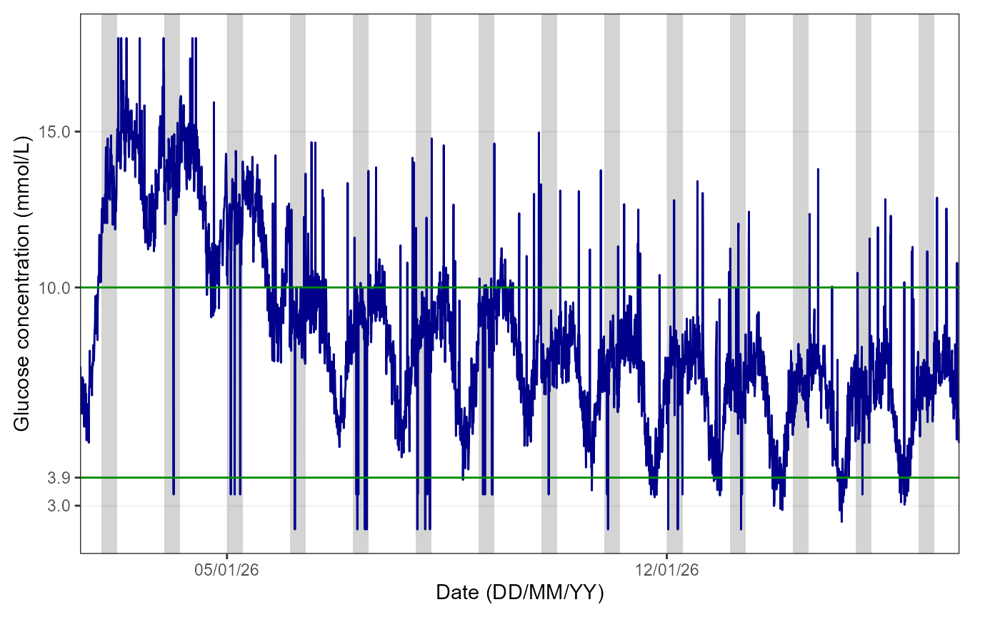
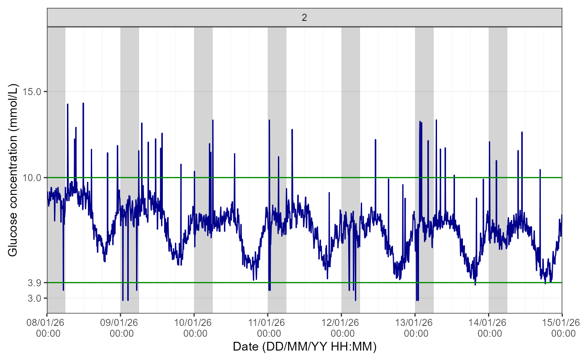
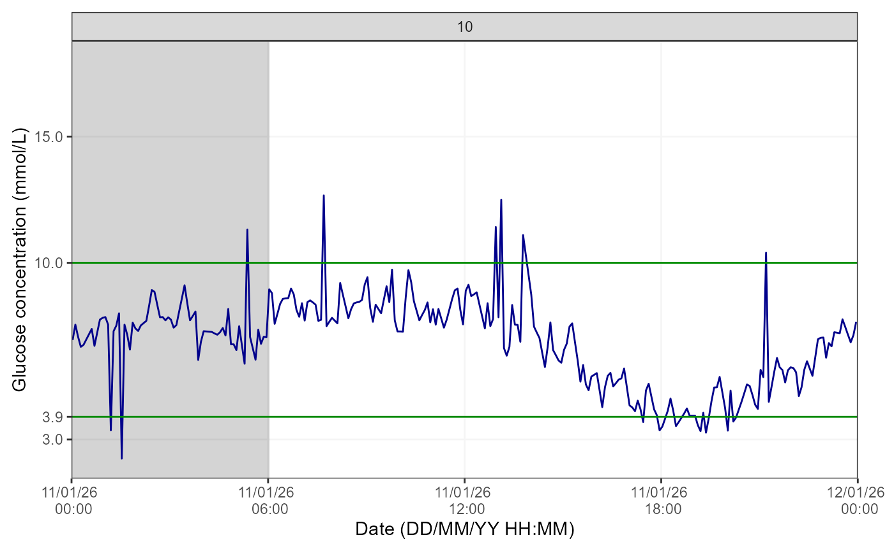

# Continuous Glucose Monitoring (CGM) Data

## 1. Introduction

The `hypometrics` package was developed to manipulate data from CGM
devices manufactured by Abbott, specifically the Abbott Freestyle Libre
2 sensor and reader. Future work will involve updating the package so it
can function with data from additional CGM devices (e.g. Dexcom).

This article describes the CGM-specific functions that were created as
part of the `hypometrics` package.

### Setup

To be able to use the CGM functions, firstly install and load
`hypometrics`.

    #Install
    install.packages("remotes")
    remotes::install_github("leicester-cdag/hypometrics")

``` r
#Load package
library(hypometrics)
```

### Simulated data

Throughout this tutorial, the examples presented will be based on the
simulated \[`raw_cgm`\] and \[`cgm`\] datasets.

These datasets include two synthetic participants, P01 and P02, with one
row per CGM timestamp. The `cgm` dataframe is a cleaner version of the
`raw_cgm` as it includes CGM data that has been interpolated. Further
information on data interpolation is provided in the next section.

- A preview of the `raw_cgm` dataframe is shown below:

``` r
utils::head(raw_cgm)
#>    id       cgm_timestamp glucose
#> 1 P01 2026-01-01 07:22:00    6.46
#> 2 P01 2026-01-01 07:27:00    6.00
#> 3 P01 2026-01-01 07:32:00    7.06
#> 4 P01 2026-01-01 07:37:00    7.63
#> 5 P01 2026-01-01 07:42:00    6.99
#> 6 P01 2026-01-01 07:47:00    6.81
```

## 2. Cleaning CGM data

### From implicit to explicit gaps in CGM data

The \[`raw_cgm`\] dataset has gaps in the CGM timestamps which are
implicit. For example, as shown below, there is a gap between 18:27 and
18:42 but the missing CGM timestamps and glucose values are not
explicitly included in the dataset. This means that gaps in the data are
not particularly obvious to the user.

``` r
raw_cgm %>% dplyr::slice(120:130)
#> # A tibble: 11 × 3
#>    id    cgm_timestamp       glucose
#>    <chr> <dttm>                <dbl>
#>  1 P01   2026-01-01 17:57:00    5.11
#>  2 P01   2026-01-01 18:07:00    4.98
#>  3 P01   2026-01-01 18:17:00    4.1 
#>  4 P01   2026-01-01 18:22:00    4.91
#>  5 P01   2026-01-01 18:27:00    4.98
#>  6 P01   2026-01-01 18:42:00    4.87
#>  7 P01   2026-01-01 18:47:00    5.43
#>  8 P01   2026-01-01 18:52:00    5.77
#>  9 P01   2026-01-01 18:57:00    5.19
#> 10 P01   2026-01-01 19:07:00    4.54
#> 11 P01   2026-01-01 19:17:00    4.19
```

  

The
[`cgmInterpolate()`](https://leicester-cdag.github.io/hypometrics/reference/cgmInterpolate.md)
function addresses this by turning these implicit gaps into explicit
gaps. In that case, it will add 18:32 and 18:37 as timestamps with the
corresponding glucose values marked as missing (i.e. NA), as shown
below. The ‘Interpolate’ argument is set to FALSE as the aim here is
solely to produce explicit gaps, not to interpolate glucose values. The
‘MinGap’ argument determines the minimum data gap considered and it is
set to 600 seconds (or 10 min) so at least 1 CGM timestamp can be added.
The desired granularity of data is 5 minutes so the ‘Granularity’
argument is set to 300 seconds.

  

``` r
cgm_explicit_gaps <- hypometrics::cgmInterpolate(raw_cgm, Interpolate = FALSE, MinGap = 600, Granularity = 300)

cgm_explicit_gaps %>% dplyr::slice(133:140)
#>    id       cgm_timestamp glucose
#> 1 P01 2026-01-01 18:22:00    4.91
#> 2 P01 2026-01-01 18:27:00    4.98
#> 3 P01 2026-01-01 18:32:00      NA
#> 4 P01 2026-01-01 18:37:00      NA
#> 5 P01 2026-01-01 18:42:00    4.87
#> 6 P01 2026-01-01 18:47:00    5.43
#> 7 P01 2026-01-01 18:52:00    5.77
#> 8 P01 2026-01-01 18:57:00    5.19
```

  

### Interpolation of CGM data

There might be instances where, following turning implicit gaps into
explicit gaps, missing glucose values need to be interpolated. This can
be done by simply changing the ‘Interpolate’ argument of the same
function to TRUE. This will allow the linear interpolation of glucose
data using the
[`stats::approx()`](https://rdrr.io/r/stats/approxfun.html) function.
The ‘MaxGap’ argument here becomes essential as it determines what is
the maximum gap for which glucose values should be interpolated. For
example, if set at 1800 seconds (the default in the function), any
glucose values in a gap longer than 30 minutes will not be interpolated
and left as NA. It is up to the user to determine what the ‘MaxGap’
should be depending on their analysis. Let’s see what the linear
interpolation looks like below, still based on our 18:27 to 18:42 gap
example from earlier.

``` r
cgm_explicit_gaps_and_interpolation <- 
  hypometrics::cgmInterpolate(raw_cgm, Interpolate = TRUE, MinGap = 600, Granularity = 300, MaxGap = 1800)

cgm_explicit_gaps_and_interpolation %>% dplyr::slice(133:140)
#>    id       cgm_timestamp glucose
#> 1 P01 2026-01-01 18:22:00    4.91
#> 2 P01 2026-01-01 18:27:00    4.98
#> 3 P01 2026-01-01 18:32:00    4.94
#> 4 P01 2026-01-01 18:37:00    4.91
#> 5 P01 2026-01-01 18:42:00    4.87
#> 6 P01 2026-01-01 18:47:00    5.43
#> 7 P01 2026-01-01 18:52:00    5.77
#> 8 P01 2026-01-01 18:57:00    5.19
```

We can see here that as the gap was less than 30 minutes, glucose values
have been linearly interpolated. The added values are 4.91 mmol/L (at
18:37) and 4.87 mmol/L (at 18:42).

## 3. Checking CGM data

After cleaning the data and before diving into data analysis, the
`checkMissingCGM()` function enables the evaluation of missingness in
glucose data.

### Sample level

Firstly, you can explore the number of hours of CGM data available per
day for all participants included by running:

``` r
hypometrics::cgmCheck(cgm)
#> # A tibble: 30 × 3
#>    id    Date       total_cgm_hours
#>    <chr> <date>               <dbl>
#>  1 P01   2026-01-01            16.6
#>  2 P01   2026-01-02            23.9
#>  3 P01   2026-01-03            23.9
#>  4 P01   2026-01-04            23.9
#>  5 P01   2026-01-05            23.9
#>  6 P01   2026-01-06            23.9
#>  7 P01   2026-01-07            23.9
#>  8 P01   2026-01-08            23.9
#>  9 P01   2026-01-09            23.9
#> 10 P01   2026-01-10            23.9
#> # ℹ 20 more rows
```

### Individual level

With the initial identification of days/participants with low CGM data
coverage in the previous step, further investigation can be conducted by
looking at CGM data from individual participants. For example:

``` r
missingness_P01 <- cgmCheck(cgm, CheckAll = FALSE, StudyID = "P01", AxisLabels = c(0, 2.2, 3.9, 10, 20))
```

This creates a list which contains a data set with daily breakdown of
available hours of CGM data for participant ‘P01’ and a graph
highlighting periods of missingness can be produced using the code
below.

``` r
graphics::plot(missingness_P01$cgm_na_distribution_plot)
```

## 4. Describing CGM data

### Continuous glucose monitoring data summary

Using the
[`cgmSummarise()`](https://leicester-cdag.github.io/hypometrics/reference/cgmSummarise.md)
function, which combines the outputs of multiple
[iglu](https://irinagain.github.io/iglu/index.html) package functions, a
summary of CGM data can be produced. This includes CGM data coverage,
mean/median glucose, glucose standard deviation/interquartile range,
coefficient of variation, time above, below and in range for each
participant. The default unit for glucose values is mmol/L but this can
be changed to mg/dL. The parameters for the interquartile range, time
in/above/below range can also be adapted depending on user’s needs.

``` r
cgmSummarise(DataFrame = cgm, GlucoseUnit = "mmol/L")
#>    id      start_date_cgm        end_date_cgm nweeks   ndays active_percent
#> 1 P01 2026-01-01 07:22:00 2026-01-15 07:12:00      2 14 days            100
#> 2 P02 2026-01-02 15:52:00 2026-01-16 15:47:00      2 14 days            100
#>   mean_glu sd_glu median_glu Q1_glu Q3_glu cv_glu above_13.9 above_10
#> 1      8.1    2.1        7.8    6.7    9.4   26.3        0.7     18.6
#> 2      8.5    2.9        7.8    6.5    9.8   34.4        6.5     23.5
#>   in_range_3.9_10 below_3.9 below_3
#> 1            80.6       0.7     0.3
#> 2            73.6       2.9     0.5
```

### Hypoglycaemia episode detection

The
[`sdhDetection()`](https://leicester-cdag.github.io/hypometrics/reference/sdhDetection.md)
function allows to automatically detect and report on every episode of
CGM-detected hypoglycaemia. The function takes CGM data and returns for
each participant all episodes of hypoglycaemia that were detected: start
and end time of episode, duration, nadir and day/night status (night:
00h00-06h00). If an episode overlaps between day and night status, it is
marked as overlap. The default hypoglycaemia detection limit is 3.9
mmol/L and duration 15 minutes.

``` r
utils::head(sdhDetection(DataFrame = cgm), n=10)
#>    id sdh_number                                     sdh_interval
#> 1 P02          1 2026-01-11 17:57:00 UTC--2026-01-11 18:42:00 UTC
#> 2 P02          2 2026-01-13 16:57:00 UTC--2026-01-13 18:47:00 UTC
#> 3 P02          3 2026-01-13 19:17:00 UTC--2026-01-13 20:27:00 UTC
#> 4 P02          4 2026-01-14 17:57:00 UTC--2026-01-14 18:22:00 UTC
#> 5 P02          5 2026-01-14 18:42:00 UTC--2026-01-14 18:57:00 UTC
#> 6 P02          6 2026-01-14 19:17:00 UTC--2026-01-14 19:52:00 UTC
#> 7 P02          7 2026-01-15 19:12:00 UTC--2026-01-15 19:52:00 UTC
#>   sdh_duration_mins sdh_nadir sdh_night_status
#> 1                45       3.4              Day
#> 2               110       3.0              Day
#> 3                70       2.9              Day
#> 4                25       2.9              Day
#> 5                15       2.5              Day
#> 6                35       3.1              Day
#> 7                40       3.3              Day
```

We can see in the table above that P02 experienced 7 episodes of
hypoglycaemia below 3.9 mmol/L of a minimum duration of 15 minutes. P01
did not experience any hypoglycaemia episodes with those
characteristics.

The default parameters can be changed to explore a different glucose
threshold, and minimum duration. For example:

``` r
utils::head(sdhDetection(DataFrame = cgm, DetectionLimit = 3, DetectionDuration = 10), n=10)
#>    id sdh_number                                     sdh_interval
#> 1 P01          1 2026-01-06 05:17:00 UTC--2026-01-06 05:27:00 UTC
#> 2 P02          1 2026-01-14 18:42:00 UTC--2026-01-14 18:57:00 UTC
#>   sdh_duration_mins sdh_nadir sdh_night_status
#> 1                10       2.9            Night
#> 2                15       2.5              Day
```

After changing the default parameters, we see that P01 experienced one
episode of hypoglycaemia below 3 mmol/L for a duration of 10 minutes.

If sleep data is available, the user can also sleep information to the
output by changing the default AddSleepStatus parameter to “yes”. For
this to run, the CGM dataset used must include a sleep_status column
(this can be obtained using the
[`cgmsleepLink()`](https://leicester-cdag.github.io/hypometrics/reference/cgmsleepLink.md)
function). For example:

``` r
linked_data <- cgmsleepLink(CgmDataFrame = cgm,
                            SleepDataFrame = hypometrics::raw_sleep)

utils::head(sdhDetection(DataFrame = linked_data,
                         AddSleepStatus = "yes"), n=10)
```

### Sensor-detected hypoglycaemia data summary

Once the list and details of all episodes of hypoglycaemia have been
produced, it might be useful to have summarised descriptive data in a
single dataset. This can be done using the
[`sdhSummarise()`](https://leicester-cdag.github.io/hypometrics/reference/sdhSummarise.md)
function. With one row per participant, the output includes the overall
number of hypoglycaemic episodes, the number occuring the night or day,
the mean duration of those episodes as well as details on longer
episodes of hypoglycaemia. The user can define how a long episode is
defined, using the ‘LongDuration’ argument. The default is 120 minutes.
This summary can be produced at any threshold of glucose, as it simply
takes the output of the
[`sdhDetection()`](https://leicester-cdag.github.io/hypometrics/reference/sdhDetection.md)
function as input. Let’s see a summary of SDH data, for a glucose
threshold of 3.9 mmol/L (the default), using our example dataset.

``` r
## Producing the list of hypoglycaemia episodes for all participants
sdh_map <- sdhDetection(DataFrame = cgm)

## Summarising SDH data
sdhSummarise(DataFrame = sdh_map)
#>    id n_sdh3.9 n_sdh3.9_day n_sdh3.9_night n_sdh3.9_overlap_daynight
#> 1 P02        7            7              0                         0
#>   mean_duration_sdh3.9 mean_duration_sdh3.9_day mean_duration_sdh3.9_night
#> 1                 48.6                     48.6                        NaN
#>   mean_duration_sdh3.9_overlap_daynight n_longsdh3.9 n_day_with_longsdh3.9
#> 1                                   NaN            0                     0
```

If sleep data is available, the parameter `AddSleepSummary` can be
turned to “yes” and the number of SD when asleep, awake or when sleep
information was missing for each SDH and participant will also be
calculated.

## 5. Visualising CGM data

It may be useful to plot CGM data to visually inspect glucose
concentrations over time. The
[`cgmVisualise()`](https://leicester-cdag.github.io/hypometrics/reference/cgmVisualise.md)
function allows you to do this at three different levels of granularity.

### Overall

Using the default function parameters, you will obtain an overview of
glucose data for the entire study period for a selected participant, as
shown below:

``` r
cgmVisualise(cgm, StudyID = "P02")
```



The figure shows the glucose trace in blue, the 3.9-10mmol/L range is
delimited by green lines. The grey area highlights the period from 00:00
to 06:00 for reference, as it is typically used when examining nocturnal
hypoglycaemia.

**Note:** if sleep tracker data is available, the user can plot this
instead by specifying “yes” to the `AddSleep` argument of the function
(default is “no”) and the `DataFrame` used must be one where CGM and
sleep data are linked.

### Week by week

It is also possible to view glucose data on a weekly basis by specifying
a breakdown by week in the `TimeBreak` argument of the function and
which week is of interest using the `PageNumber` argument, as shown
below:

``` r
cgmVisualise(cgm, StudyID = "P01", TimeBreak = "week", PageNumber = 2)
```

  

The number at the top of the figure indicates the week selected for
visualisation. Please note the function will return an error if the
picked PageNumber (i.e. here, week number) is out of the data range
(e.g. PageNumber = 5 when there are only 4 weeks of data).

### Day by day

Lastly, for further granularity, there is an option to visualise this
data for specific days using the same logic as for the weekly data.

``` r
cgmVisualise(cgm, StudyID = "P02", TimeBreak = "day", PageNumber = 10)
```

  

The number at the top of the figure indicates the day selected for
visualisation. Please note the function will return an error if the
picked PageNumber (i.e. here, day number) is out of the data range
(e.g. PageNumber = 15 when there are only 14 days of data).
