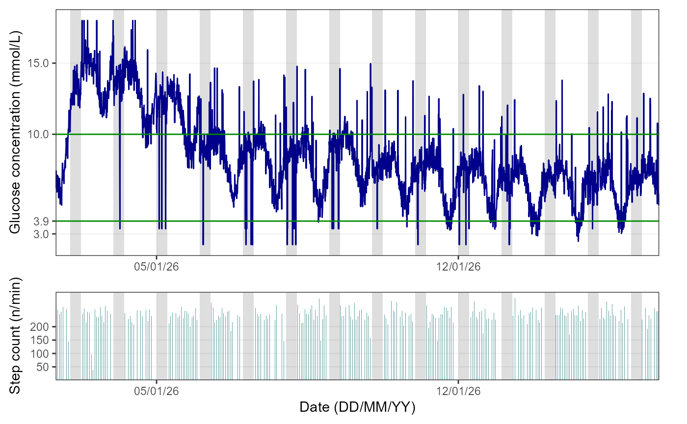
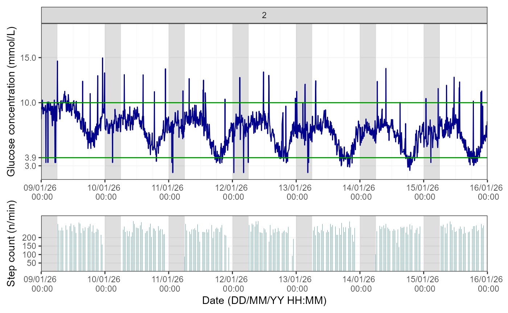
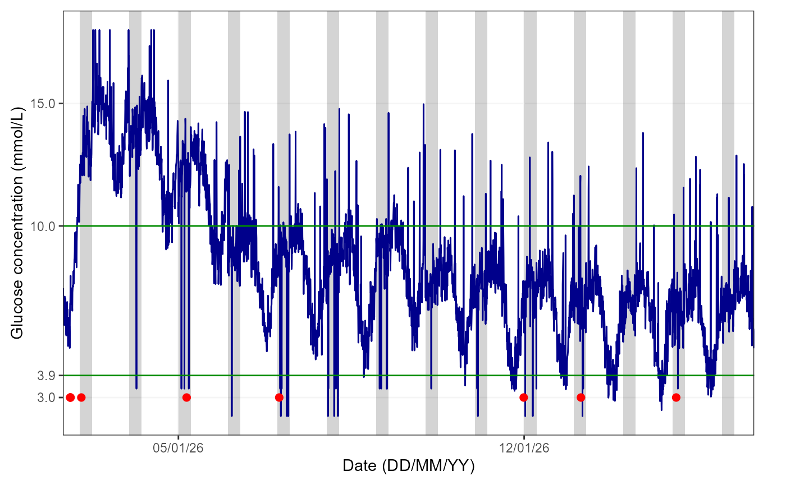

# Linking CGM, Activity, Sleep and Person-Reported Hypoglycaemia Data

## 1. Introduction

The `hypometrics` package was built to handle glucose, person-reported
hypoglycaemia, physical activity and sleep data both individually and in
combination. This tutorial describes functions that allows the user to
link these data and visualise the linked outputs.

### Setup

To be able to use the step count and heart rate functions, firstly
install and load `hypometrics`.

    #Install
    install.packages("remotes")
    remotes::install_github("leicester-cdag/hypometrics")

``` r
#Load package
library(hypometrics)
```

## 2. Linking CGM and sleep data

The function
[`cgmsleepLink()`](https://leicester-cdag.github.io/hypometrics/reference/cgmsleepLink.md)
allows the user to link CGM data with sleep data from an activity
tracker, here the Fitbit Charge 4. Thus, using this function, the user
would be able to determine whether the participant was asleep or awake
at the time of a hypoglycaemic event for example. The function requires
the CGM dataframe in a format such as the one described in the [CGM data
tutorial](https://leicester-cdag.github.io/hypometrics/articles/cgm_data.html)
and a sleep data frame such as the one described in the [Sleep data
tutorial](https://leicester-cdag.github.io/hypometrics/articles/sleep_data.html).

The output of that function is a data frame in a long format with a
sleep status (either asleep, awake or NA i.e. missing) for each CGM
timestamp and glucose value, as shown below.

``` r
hypometrics::cgmsleepLink(CgmDataFrame = hypometrics::cgm,
                          SleepDataFrame = hypometrics::raw_sleep) %>%
  dplyr::slice(1:10)
#>     id sleep_status       cgm_timestamp glucose
#> 1  P01       Asleep 2026-01-01 07:22:00    6.46
#> 2  P01       Asleep 2026-01-01 07:27:00    6.00
#> 3  P01       Asleep 2026-01-01 07:32:00    7.06
#> 4  P01       Asleep 2026-01-01 07:37:00    7.63
#> 5  P01        Awake 2026-01-01 07:42:00    6.99
#> 6  P01        Awake 2026-01-01 07:47:00    6.81
#> 7  P01        Awake 2026-01-01 07:52:00    6.26
#> 8  P01        Awake 2026-01-01 07:57:00    6.69
#> 9  P01        Awake 2026-01-01 08:02:00    6.74
#> 10 P01        Awake 2026-01-01 08:07:00    6.23
```

## 3. Linking CGM and activity data

The function
[`cgmactivityLink()`](https://leicester-cdag.github.io/hypometrics/reference/cgmactivityLink.md)
allows the user to link CGM data with step count and heart rate data
from an activity tracker, here the Fitbit Charge 4. Thus, using this
function, the user would be able to determine number of steps or heart
rate before the onset of a hypoglycaemic event for example.

The user has two options using the `DataType` parameter of the function:
to link CGM data with step count data (i.e. DataType = “stepcount”) or
with heart rate data (i.e., DataType = “heartrate”). CGM, step count and
heart rate data must be in the same format as previously described for
the function to run smoothly.

The function works out the number of step/heart rate timestamps between
two consecutive CGM timestamps and either returns the exact step
count/heart rate (if a single timestamp is detected) or an average (if
multiple timestamps fit within each CGM timestamp). The latter would be
when for example, the heart rate data is more granular than the CGM
data.

The output of the function is a dataset where for each CGM timestamp and
glucose value, there is a corresponding step count/heart rate value if
data is available or missing value if no step count/heart rate
timestamps fitted within the CGM timestamps.

### CGM linked with step count data:

``` r
hypometrics::cgmactivityLink(CgmDataFrame = hypometrics::cgm,
                             ActivityDataFrame = hypometrics::raw_step,
                             DataType = "stepcount") %>%
  dplyr::slice(1:10)
#>     id       cgm_timestamp glucose step_count
#> 1  P01 2026-01-01 07:22:00    6.46        204
#> 2  P01 2026-01-01 07:27:00    6.00        189
#> 3  P01 2026-01-01 07:32:00    7.06        178
#> 4  P01 2026-01-01 07:37:00    7.63        236
#> 5  P01 2026-01-01 07:42:00    6.99        205
#> 6  P01 2026-01-01 07:47:00    6.81        171
#> 7  P01 2026-01-01 07:52:00    6.26        215
#> 8  P01 2026-01-01 07:57:00    6.69        197
#> 9  P01 2026-01-01 08:02:00    6.74        214
#> 10 P01 2026-01-01 08:07:00    6.23        210
```

### CGM linked with heart data:

``` r
hypometrics::cgmactivityLink(CgmDataFrame = hypometrics::cgm,
                             ActivityDataFrame = hypometrics::raw_hr,
                             DataType = "heartrate") %>%
  dplyr::slice(1:10)
#>     id       cgm_timestamp glucose heart_rate
#> 1  P01 2026-01-01 07:22:00    6.46         67
#> 2  P01 2026-01-01 07:27:00    6.00         66
#> 3  P01 2026-01-01 07:32:00    7.06         65
#> 4  P01 2026-01-01 07:37:00    7.63         71
#> 5  P01 2026-01-01 07:42:00    6.99         68
#> 6  P01 2026-01-01 07:47:00    6.81         65
#> 7  P01 2026-01-01 07:52:00    6.26         70
#> 8  P01 2026-01-01 07:57:00    6.69         68
#> 9  P01 2026-01-01 08:02:00    6.74         71
#> 10 P01 2026-01-01 08:07:00    6.23         71
```

## 4. Visualising CGM and activity data

To visualise CGM data linked with step count or heart rate data, the
function
[`cgmactivityVisualise()`](https://leicester-cdag.github.io/hypometrics/reference/cgmactivityVisualise.md)
can be used. Similarly to the
[`cgmVisualise()`](https://leicester-cdag.github.io/hypometrics/reference/cgmVisualise.md)
function, this function allows the user to visualise CGM and activity
data over time at three different levels of granularity. For the
function to run, the `DataFrame` used must be containing CGM data linked
with step count or heart rate data (e.g. output of the
[`cgmactivityLink()`](https://leicester-cdag.github.io/hypometrics/reference/cgmactivityLink.md)
function).

### Overall

Using the default function parameters, you will obtain an overview of
glucose and activity data for the entire study period for a selected
participant.

To visualise CGM and step count data, the user needs to specify
“stepcount” for the `DataType` argument, as shown below:

``` r
## Creating the linked CGM and step count dataset
linked_data <- hypometrics::cgmactivityLink(CgmDataFrame = hypometrics::cgm,
                             ActivityDataFrame = hypometrics::raw_step,
                             DataType = "stepcount") 

##Visualising the linked data
cgmactivityVisualise(DataFrame = linked_data,
                     StudyID = "P02",
                     DataType = "stepcount")
```



The figures shows the glucose trace in dark blue (the 3.9-10mmol/L range
is delimited by green lines) and the step count bars in cadet blue. By
default, the function will produce a figure with a light grey area
highlighting the period from 00:00 to 06:00, as it is typically used
when examining nocturnal hypoglycaemia.

To visualise CGM and heart rate data, the user needs to specify
“heartrate” for the `DataType` argument, as shown below:

``` r
## Creating the linked CGM and heart rate dataset
linked_data <- hypometrics::cgmactivityLink(CgmDataFrame = hypometrics::cgm,
                             ActivityDataFrame = hypometrics::raw_hr,
                             DataType = "heartrate") 

##Visualising the linked data
cgmactivityVisualise(DataFrame = linked_data,
                     StudyID = "P01",
                     DataType = "heartrate")
```

The figure shows the glucose trace in dark blue (the 3.9-10mmol/L range
is delimited by green lines) and heart rate trace in dark red. By
default, the function will produce a figure with a light grey area
highlighting the period from 00:00 to 06:00, as it is typically used
when examining nocturnal hypoglycaemia.

**Note:** if sleep tracker data is available, the user can plot this
instead by specifying “yes” to the `AddSleep` argument of the function
(default is “no”) and the `DataFrame` used must be one where CGM and
sleep data are linked.

### Week by week

It is also possible to view glucose and activity data on a weekly basis
by specifying a breakdown by week in the `TimeBreak` argument of the
function and which week is of interest using the `PageNumber`
argument.The number at the top of the figure indicates the week selected
for visualisation. Please note the function will return an error if the
picked PageNumber (i.e. here, week number) is out of the data range
(e.g. PageNumber = 11 when there are only 10 weeks of data).

To visualise CGM and step count data, the user needs to further specify
“stepcount” for the `DataType` argument, as shown below:

``` r
## Visualising the linked dataset
cgmactivityVisualise(DataFrame = linked_data,
                     StudyID = "P02",
                     TimeBreak = "week",
                     PageNumber = 2,
                     DataType = "stepcount")
```



If the user requires a CGM and heart rate visualisation instead, the
DataType parameter would need to be changed to “heartrate”.

### Day by day

Lastly, for further granularity, there is an option to visualise this
data for specific days using the same logic as for the weekly data.

To visualise CGM and step count data, the user needs to further specify
“stepcount” for the `DataType` argument, as shown below:

``` r
## Visualising the linked dataset
cgmactivityVisualise(DataFrame = linked_data,
                     StudyID = "P01",
                     TimeBreak = "day",
                     PageNumber = 6,
                     DataType = "stepcount")
```

If the user requires a CGM and heart rate visualisation instead, the
DataType parameter would need to be changed to “heartrate”.

## 5. Linking CGM and Person-Reported Hypoglycaemia data

The function
[`cgmprhLink()`](https://leicester-cdag.github.io/hypometrics/reference/cgmprhLink.md)
allows the user to link CGM data with person-reported hypoglycaemia data
from the Hypo-METRICS app. Thus, using this function, the user would be
able to determine how sensor-detected hypoglycaemia (CGM) align with
person-reported hypoglycaemia, for example.

For the function to run smoothly, the user needs firstly to build a PRH
map in the wide format containing at least an ID and PRH timestamp
column. This can be obtained by firstly running
[`umotifClean()`](https://leicester-cdag.github.io/hypometrics/reference/umotifClean.md)
function followed by the
[`prhLink()`](https://leicester-cdag.github.io/hypometrics/reference/prhLink.md)
function, as shown below:

``` r
## Cleaning motif and checkin data 
motif <- umotifClean(DataFrame = hypometrics::raw_motif_segment,
                     FileType = "motif")
checkin <- umotifClean(DataFrame = hypometrics::raw_checkin,
                       FileType = "checkin")

## Creating the linked PRH dataset
prh_map <- prhLink(MotifDataFrame = motif,
                   CheckinDataFrame = checkin)

##Creating the linked CGM PRH data
cgmprhLink(CgmDataFrame = hypometrics::cgm,
           PrhDataFrame = prh_map) %>%
  dplyr::slice(55:65)
#>     id       cgm_timestamp glucose checkin_prh_timestamp motif_prh_timestamp
#> 1  P01 2026-01-01 11:52:00    7.05                  <NA>                <NA>
#> 2  P01 2026-01-01 11:57:00    7.36                  <NA>                <NA>
#> 3  P01 2026-01-01 12:02:00    7.10                  <NA>                <NA>
#> 4  P01 2026-01-01 12:07:00    6.86                  <NA>                <NA>
#> 5  P01 2026-01-01 12:12:00    6.15                  <NA>                <NA>
#> 6  P01 2026-01-01 12:17:00    6.77                  <NA>                <NA>
#> 7  P01 2026-01-01 12:22:00    6.26                  <NA> 2026-01-01 12:22:00
#> 8  P01 2026-01-01 12:27:00    6.74                  <NA>                <NA>
#> 9  P01 2026-01-01 12:32:00    6.95                  <NA>                <NA>
#> 10 P01 2026-01-01 12:37:00    6.27                  <NA>                <NA>
#> 11 P01 2026-01-01 12:42:00    6.36                  <NA>                <NA>
```

The output shows a PRH timestamp on the same row as the closest CGM
timestamp: the participant reported a hypoglycaemia episode using the
Hypo-METRICS app at 12:22 which aligns with CGM data as at the time
(12:22). However, the glucose value (6.26 mmmol/L) was not below the
hypoglycaemia threshold of 3.9 mmol/L.

## 6. Linking Sensor-Detected and Person-Reported Hypoglycaemia data

The function
[`sdhprhLink()`](https://leicester-cdag.github.io/hypometrics/reference/sdhprhLink.md)
allows the integration of sensor-detected hypoglycaemia (SDH) data with
person-reported hypoglycaemia data. In other words, episodes of SDH are
mapped out against episodes of PRH according to timing of episodes and
the user is able to assess the overlap between the two event types.

As a pre-requisite of this function, the user would need to use the
[`sdhDetection()`](https://leicester-cdag.github.io/hypometrics/reference/sdhDetection.md),
[`umotifClean()`](https://leicester-cdag.github.io/hypometrics/reference/umotifClean.md)
and
[`prhLink()`](https://leicester-cdag.github.io/hypometrics/reference/prhLink.md)
functions to produce the relevant SDH and PRH maps, as shown below:

``` r
## Cleaning PRH data
motif <- umotifClean(DataFrame = hypometrics::raw_motif_segment,
                     FileType = "motif")
checkin <- umotifClean(DataFrame = hypometrics::raw_checkin,
                       FileType = "checkin")

## Creating the SDH and PRH maps
sdh_map <- sdhDetection(DataFrame = hypometrics::cgm)
prh_map <- prhLink(MotifDataFrame = motif,
                   CheckinDataFrame = checkin)

##Creating the linked SDH PRH data
sdhprhLink(SdhDataFrame = sdh_map, 
           PrhDataFrame = prh_map) %>%
  dplyr::slice(1:10) %>% 
  dplyr::select(id, sdh_interval, checkin_prh_timestamp, motif_prh_timestamp, sdh_duration_mins, sdh_nadir, symptomatic_prh)
#>    id                                     sdh_interval checkin_prh_timestamp
#> 1   1                                           NA--NA                  <NA>
#> 2   1                                           NA--NA   2026-01-07 04:08:00
#> 3   1 2026-01-11 17:57:00 UTC--2026-01-11 18:42:00 UTC                  <NA>
#> 4   1                                           NA--NA   2026-01-12 04:01:00
#> 5   1                                           NA--NA   2026-01-12 22:17:00
#> 6   1 2026-01-13 16:57:00 UTC--2026-01-13 18:47:00 UTC                  <NA>
#> 7   1 2026-01-13 19:17:00 UTC--2026-01-13 20:27:00 UTC                  <NA>
#> 8   1 2026-01-14 17:57:00 UTC--2026-01-14 18:22:00 UTC                  <NA>
#> 9   1 2026-01-14 18:42:00 UTC--2026-01-14 18:57:00 UTC                  <NA>
#> 10  1 2026-01-14 19:17:00 UTC--2026-01-14 19:52:00 UTC                  <NA>
#>    motif_prh_timestamp sdh_duration_mins sdh_nadir symptomatic_prh
#> 1  2026-01-01 12:22:00                NA        NA             Yes
#> 2                 <NA>                NA        NA              No
#> 3                 <NA>                45       3.4            <NA>
#> 4                 <NA>                NA        NA              No
#> 5                 <NA>                NA        NA              No
#> 6                 <NA>               110       3.0            <NA>
#> 7                 <NA>                70       2.9            <NA>
#> 8                 <NA>                25       2.9            <NA>
#> 9                 <NA>                15       2.5            <NA>
#> 10                <NA>                35       3.1            <NA>
```

The output contains all the information available in the individual SDH
and PRH maps including symptoms reported and whether event occurred
during the day or night, but for illustrative purposes here, only a
limited number of columns are shown. We can see that there was no
overlap between SDH and PRH episodes for this participant.

## 7. Visualising CGM and Person-Reported Hypoglycaemia data

To visualise CGM data linked with person-reported hypoglycaemia data,
the function
[`cgmprhVisualise()`](https://leicester-cdag.github.io/hypometrics/reference/cgmprhVisualise.md)
can be used. Similarly to the
[`cgmVisualise()`](https://leicester-cdag.github.io/hypometrics/reference/cgmVisualise.md)
function, this function allows the user to visualise CGM and
hypoglycaemia data over time at three different levels of granularity.
For the function to run, the `DataFrame` used must be containing CGM
data linked with hypoglycaemia data (e.g. output of the
[`cgmprhLink()`](https://leicester-cdag.github.io/hypometrics/reference/cgmprhLink.md)
function).

### Overall

Using the default function parameters, you will obtain an overview of
glucose and hypoglycaemia data for the entire study period for a
selected participant.

``` r
## Cleaning motif and checkin data 
motif <- umotifClean(DataFrame = hypometrics::raw_motif_segment,
                     FileType = "motif")
checkin <- umotifClean(DataFrame = hypometrics::raw_checkin,
                       FileType = "checkin")

## Creating the linked PRH dataset
prh_map <- prhLink(MotifDataFrame = motif,
                   CheckinDataFrame = checkin)

##Creating the linked CGM PRH data
linked_data <- cgmprhLink(CgmDataFrame = hypometrics::cgm,
                          PrhDataFrame = prh_map)

##Visualising the linked data
cgmprhVisualise(DataFrame = linked_data,
                StudyID = "P02")
```



The red dots over the blue glucose trace indicate date and times when
participants reported episodes of hypoglycaemia.By default, the function
will produce a figure with a light grey area highlighting the period
from 00:00 to 06:00, as it is typically used when examining nocturnal
hypoglycaemia.

**Note:** if sleep tracker data is available, the user can plot this
instead by specifying “yes” to the `AddSleep` argument of the function
(default is “no”) and the `DataFrame` used must be one where CGM and
sleep data are linked.

The user can also have a closer look at how person-reported
hypoglycaemia episodes align with sensor-detected hypoglycaemia by
visualising specific weeks/days as explained in the sections below.

### Week by week

It is also possible to view glucose and hypoglycaemia data on a weekly
basis by specifying a breakdown by week in the `TimeBreak` argument of
the function and which week is of interest using the `PageNumber`
argument.The number at the top of the figure indicates the week selected
for visualisation. Please note the function will return an error if the
picked PageNumber (i.e. here, week number) is out of the data range
(e.g. PageNumber = 11 when there are only 10 weeks of data).

``` r
##Visualising the linked data
cgmprhVisualise(DataFrame = linked_data,
                StudyID = "P01",
                TimeBreak = "week",
                PageNumber = 2)
```

### Day by day

Lastly, for further granularity, there is an option to visualise this
data for specific days using the same logic as for the weekly data.

``` r
## Visualising the linked dataset
cgmprhVisualise(DataFrame = linked_data,
                StudyID = "P01",
                TimeBreak = "day",
                PageNumber = 2)
```
