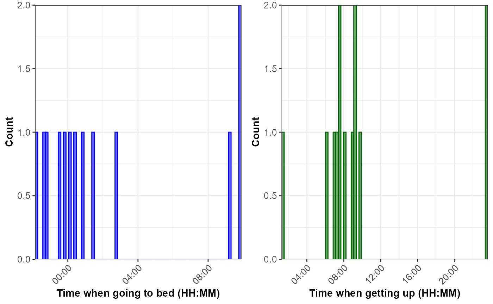

# Sleep Data

## 1. Introduction

The `hypometrics` package was built to handle physical activity and
sleep data generated by the FitBit Charge 4. Future work will consist of
augmenting the package’s adaptability in order to read in data from
different Fitbit devices or other activity and sleep trackers
(e.g. Garmin).

This article describes the sleep-specific functions that were created as
part of the `hypometrics` package.

### Setup

To be able to use the sleep functions, firstly install and load
`hypometrics`.

    #Install
    install.packages("remotes")
    remotes::install_github("leicester-cdag/hypometrics")

``` r
#Load package
library(hypometrics)
```

### Simulated data

Throughout this tutorial, the examples presented will be based on the
[`raw_sleep`](https://leicester-cdag.github.io/hypometrics/reference/raw_sleep.html)
simulated dataset.

- A preview of the `raw_sleep` dataframe is shown below:

``` r
utils::head(raw_sleep)
#>    id dateOfSleep      logId           startTime             endTime duration
#> 1 P01  2026-01-01 1233452892 2025-12-31 22:48:09 2026-01-01 07:39:11 31860000
#> 2 P01  2026-01-02 5249981493 2026-01-01 22:56:55 2026-01-02 09:12:50 36900000
#> 3 P01  2026-01-03 5332094017 2026-01-03 00:58:40 2026-01-03 06:02:19 18180000
#> 4 P01  2026-01-04 5467075058 2026-01-04 02:27:50 2026-01-04 06:53:22 15900000
#> 5 P01  2026-01-05 2014372548 2026-01-05 02:47:08 2026-01-05 08:09:16 19320000
#> 6 P01  2026-01-09 1290069097 2026-01-08 23:21:35 2026-01-09 06:12:06 24600000
#>   timeInBed minutesAsleep minutesAwake
#> 1       531           377          154
#> 2       615           523           92
#> 3       303           244           59
#> 4       265           188           77
#> 5       322           274           48
#> 6       410           318           92
```

## 2. Reading sleep data

The function
[`sleepRead()`](https://leicester-cdag.github.io/hypometrics/reference/sleepRead.md)
allows the user to read and combine raw sleep files downloaded directly
from their Fitbit account. If the downloaded folder is zipped, there is
the option to unzip the folder by setting the `Unzip` argument to TRUE.
This will create a new folder in the selected `Folder Path` called
`Unzipped Fitbit`. The Fitbit file type to read must be specified using
the `FileType` argument, either json or csv. As the individual files do
not contain personal identifiers, it might be useful to add an ID column
across the files to easily identify participants. It is possible to do
this using the `StudyID` argument of the function.

An example of the syntax is shown below:

``` r
hypometrics::sleepRead(Unzip = F,
                       FolderPath = "C:/Users",
                       FileType = "json",
                       StudyID = "P02")
```

## 3. Cleaning sleep data

The
[`sleepCategorise()`](https://leicester-cdag.github.io/hypometrics/reference/sleepCategorise.md)
function allows the user to separate the raw sleep data into three
distinct datasets that can be used for specific needs.

### Overview of sleep periods

The `sleep_overview` is a dataset containing overall sleep information
including sleep start and end times as well as the number of minutes
awake, time spent in bed and duration of sleep as shown below. Each
sleep event is tagged with a specific logId (internal to Fitbit). The
logId can be used to identify specific sleep events and merge sleep
information across the three datasets. The first 8 columns of the
`sleep_overview` dataset are shown below.

``` r
sleepCategorise(raw_sleep) %>%
  dplyr::slice(1:6)
#>    id dateOfSleep      logId           startTime             endTime duration
#> 1 P01  2026-01-01 1233452892 2025-12-31 22:48:09 2026-01-01 07:39:11 31860000
#> 2 P01  2026-01-02 5249981493 2026-01-01 22:56:55 2026-01-02 09:12:50 36900000
#> 3 P01  2026-01-03 5332094017 2026-01-03 00:58:40 2026-01-03 06:02:19 18180000
#> 4 P01  2026-01-04 5467075058 2026-01-04 02:27:50 2026-01-04 06:53:22 15900000
#> 5 P01  2026-01-05 2014372548 2026-01-05 02:47:08 2026-01-05 08:09:16 19320000
#> 6 P01  2026-01-06         NA 2026-01-05 08:09:17 2026-01-08 23:21:34       NA
#>   timeInBed minutesAsleep minutesAwake
#> 1       531           377          154
#> 2       615           523           92
#> 3       303           244           59
#> 4       265           188           77
#> 5       322           274           48
#> 6        NA            NA           NA
```

## 4. Describing sleep data

The `sleepSummarise` function allows the user to summarise raw sleep
data to obtain a dataset with one row per participant including the
number of nights with missing data, average time in bed, asleep or
awake.

``` r
sleepSummarise(raw_sleep)
#> # A tibble: 2 × 6
#>   id    n_nights_missing n_nights_with_sleep_data average_time_in_bed_hours
#>   <chr>            <dbl>                    <dbl>                     <dbl>
#> 1 P01                  3                       10                         7
#> 2 P02                  3                       10                         8
#> # ℹ 2 more variables: average_time_asleep_hours <dbl>,
#> #   average_time_awake_hours <dbl>
```

## 5. Visualising sleep data

The `sleepVisualise` function allows the user to visualise the
distribution of times when participants went to bed and got out of bed,
as shown below. The default is to plot the histogram for all times
recorded by the Fitbit for all participants. To facilitate
interpretation of the sleeping patterns, the function centres the times
when going to bed around midnight.

``` r
sleepVisualise(raw_sleep)
```

If the user needs to visualise data for a specific participant, this can
be done by changing the argument `VisualiseAll` to FALSE and indicating
the participant id of interest in the `StudyID` argument, as shown
below:

``` r
sleepVisualise(raw_sleep, VisualiseAll = FALSE, StudyID = "P02")
```


