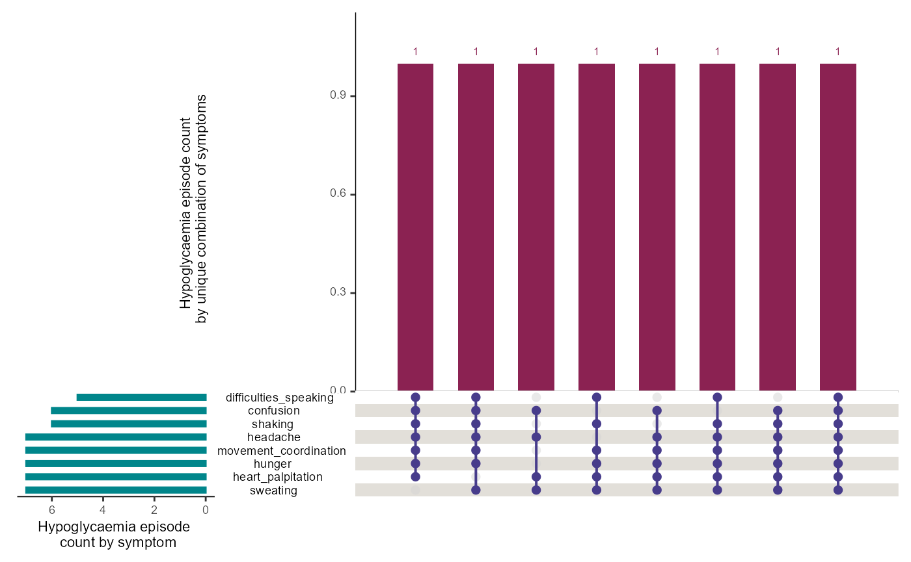
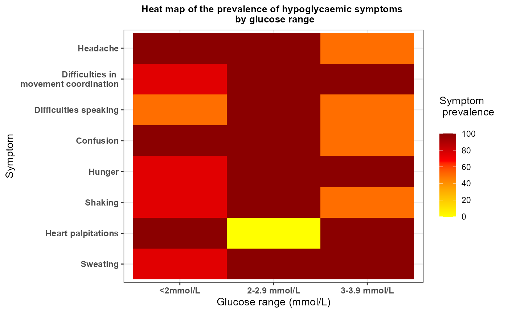

# Person-Reported Hypoglycaemia Data

## 1. Introduction

As part of the Hypo-METRICS study, the bespoke Hypo-METRICS app was
developed via the software platform provided by [uMotif
Limited](https://www.umotif.com) which recorded in real-time and
retrospectively through daily questionnaires, person-reported
hypoglycaemia episodes, their symptoms and impact on daily life. The app
also included validated questionnaires such as the Work Productivity and
Activity Impairment (WPAI), EuroQol-5 Dimensions-5 Levels (EQ-5D-5L) and
Patient-Reported Outcomes Measurement Information System (PROMIS)
questionnaires. The `hypometrics` package reads in data from the
original version of the Hypo-METRICS app. The Hypo-METRICS app features
have since evolved and future work will ensure that this is reflected in
the package.

This article describes the uMotif-specific functions that were created
as part of the `hypometrics` package.

### Setup

To be able to use the uMotif functions, firstly install and load
`hypometrics`.

    #Install
    install.packages("remotes")
    remotes::install_github("leicester-cdag/hypometrics")

``` r
#Load package
library(hypometrics)
```

### Simulated data

Throughout this tutorial, the examples presented will be based on the
[`raw_motif_segment`](https://leicester-cdag.github.io/hypometrics/reference/raw_motif_segment.html),
[`raw_checkin`](https://leicester-cdag.github.io/hypometrics/reference/raw_checkin.html),
[`raw_promis`](https://leicester-cdag.github.io/hypometrics/reference/raw_promis.html),
[`raw_eq5d5l`](https://leicester-cdag.github.io/hypometrics/reference/raw_eq5d5l.html)
and
[\`raw_wpai](https://leicester-cdag.github.io/hypometrics/reference/raw_wpai.html)
datasets.

## 2. Reading uMotif data

The function `uMotifRead()` allows the user to read raw uMotif files
downloaded directly from the uMotif data download portal. If the
downloaded folder is zipped, there is the option to unzip the folder by
setting the `Unzip` argument to TRUE. This will create a new folder in
the selected `Folder Path` called `Unzipped uMotif`. The Fitbit file to
read must be specified using the `FilePattern` argument, for example the
morning check-in as shown below:

``` r
hypometrics::uMotifRead(Unzip = F,
                       FolderPath = "C:/Users",
                       FilePattern = "morning-checkin")
```

Other examples of file types could be `evening-checkin` for the daily
evening questionnaire, `motif-segment` for the real-time person-reported
hypoglycaemic episodes and symptoms or `promis` for the weekly PROMIS
questionnaire.

## 3. Cleaning uMotif data

The
[`umotifClean()`](https://leicester-cdag.github.io/hypometrics/reference/umotifClean.md)
function allows the user to clean umotif data according to the type of
file.

### Real-time person-reported hypoglycaemic episodes

If the `FileType` argument of the function is set to `"motif"`, the
function will turn raw data into a dataset with one raw for each episode
of hypoglycaemia episodes per individual, along with the timing of each
episode, glucose concentration and intensity of symptoms reported in
real-time using the motif flower in the app. For more information
regarding how episodes of hypoglycaemia were reported during the
Hypo-METRICS study, please refer to this
[article](https://onlinelibrary.wiley.com/doi/10.1111/dme.14892).

``` r
umotifClean(DataFrame = raw_motif_segment,
            FileType = "motif")
#> # A tibble: 8 × 14
#>   id    motif_prh_number uMotifTime          prh_time   motif_prh_timestamp
#>   <chr>            <int> <dttm>              <fct>      <dttm>             
#> 1 P01                  1 2026-01-01 12:22:00 Now        2026-01-01 12:22:00
#> 2 P01                  2 2026-01-08 07:17:00 >1h ago    NA                 
#> 3 P01                  3 2026-01-15 07:17:00 15mins ago 2026-01-15 07:02:00
#> 4 P02                  1 2026-01-02 19:25:00 Now        2026-01-02 19:25:00
#> 5 P02                  2 2026-01-02 19:30:00 Now        2026-01-02 19:30:00
#> 6 P02                  3 2026-01-02 19:35:00 Now        2026-01-02 19:35:00
#> 7 P02                  4 2026-01-13 03:52:00 15mins ago 2026-01-13 03:37:00
#> 8 P02                  5 2026-01-16 15:52:00 >1h ago    NA                 
#> # ℹ 9 more variables: glucose_concentration <fct>, sweating <fct>,
#> #   heart_palpitation <fct>, shaking <fct>, hunger <fct>, confusion <fct>,
#> #   difficulties_speaking <fct>, movement_coordination <fct>, headache <fct>
```

### Person-reported hypoglycaemic episodes recorded retrospectively

  

If the `FileType` argument of the function is set to `"checkin"`, the
function will turn raw data into a dataset with one raw for each episode
of hypoglycaemia episodes per individual, along with the timing of each
episode, how participant detected the episode and what course of action
was undertaken at the time of the episode. These are episodes reported
retrospectively using the daily morning and evening questionnaires. For
more information regarding how episodes of hypoglycaemia were reported
during the Hypo-METRICS study, please refer to this
[article](https://onlinelibrary.wiley.com/doi/10.1111/dme.14892).

  

``` r
umotifClean(DataFrame = raw_checkin,
            FileType = "checkin") 
#> # A tibble: 9 × 9
#>   id    checkin_prh_number stage        localTimestamp      Which_hypo
#>   <chr>              <int> <chr>        <dttm>              <chr>     
#> 1 P01                    1 Day-7        2026-01-07 09:41:45 first     
#> 2 P01                    2 Day-12       2026-01-12 09:41:45 first     
#> 3 P01                    3 Day-13       2026-01-13 09:41:45 first     
#> 4 P02                    1 Registration 2026-01-02 08:35:19 first     
#> 5 P02                    2 Day-2        2026-01-03 08:35:19 first     
#> 6 P02                    3 Day-4        2026-01-05 08:35:19 first     
#> 7 P02                    4 Day-6        2026-01-07 08:35:19 first     
#> 8 P02                    5 Day-11       2026-01-12 08:35:19 first     
#> 9 P02                    6 Day-14       2026-01-15 08:35:19 first     
#> # ℹ 4 more variables: Atwhattimedidthishappen <dttm>,
#> #   Howdidyoudetectyourhypoorahypothatwasabouttohappen <chr>,
#> #   Howdidyoudetectyourhypoorahypothatwasabouttohappenotherpleasespecify <lgl>,
#> #   Whathappened <chr>
```

### Work Productivity and Activity Impairment (WPAI) data

  

If the `FileType` argument of the function is set to `"wpai"`, the
function will calculate WPAI scores based on raw data. These scores give
an insight of the impact of hypoglycaemia on work and activity. Higher
scores indicate greater impairment and less productivity as a result of
hypoglycaemia. Four scores are calculated: percent work time missed due
to hypoglycaemia, percent impairment while working due to hypoglycaemia,
percent overall work impairment due to hypoglycaemia and percent
activity impairment due to hypoglycaemia. Scores are multiplied by 100
to express in percentages.

  

``` r
umotifClean(DataFrame = raw_wpai,
            FileType = "wpai") 
#> # A tibble: 6 × 7
#>   id    stage       localTimestamp percent_worktime_mis…¹ percent_impairment_w…²
#>   <chr> <chr>       <chr>                           <dbl>                  <dbl>
#> 1 P01   Day-14      2026-01-15T07…                    3                       30
#> 2 P01   Day-7       2026-01-08T07…                    0                       30
#> 3 P01   Registrati… 2026-01-01T07…                    3.6                     20
#> 4 P02   Day-14      2026-01-16T15…                    2.2                     10
#> 5 P02   Day-7       2026-01-09T15…                    6.7                     30
#> 6 P02   Registrati… 2026-01-02T15…                  100                       20
#> # ℹ abbreviated names: ¹​percent_worktime_missed_due_hypo,
#> #   ²​percent_impairment_whileworking_due_hypo
#> # ℹ 2 more variables: percent_overall_work_impairment_due_hypo <dbl>,
#> #   percent_activity_impairment_due_hypo <dbl>
```

### EuroQol-5 Dimensions-5 Levels (EQ-5D-5L) data

  

If the `FileType` argument of the function is set to `"eq5d5l"`, the
function will recode raw responses to numerical values ranging from 1 to
5. The EQ-5D-5L includes questions on mobility (MB), self-care (SC),
usual activities (UA), pain/discomfort (PD) and anxiety/depression (AD).

  

``` r
umotifClean(DataFrame = raw_eq5d5l,
            FileType = "eq5d5l")
#>   userid        stage                localTimestamp SC AD UA MB PD
#> 1    P01       Day-14 2026-01-15T07:17:00.000+00:00  5  2  3  4  1
#> 2    P01        Day-7 2026-01-08T07:17:00.000+00:00  3  2  3  5  2
#> 3    P01 Registration 2026-01-01T07:17:00.000+00:00  1  1  2  3  4
#> 4    P02       Day-14 2026-01-16T15:52:00.000+00:00  1  2  4  2  3
#> 5    P02        Day-7 2026-01-09T15:52:00.000+00:00  4  3  4  4  2
#> 6    P02 Registration 2026-01-02T15:52:00.000+00:00  5  5  2  5  1
```

### Patient-Reported Outcomes Measurement Information System (PROMIS) data

  

If the `FileType` argument of the function is set to `"promis"`, the
function will calculate sum scores and associated T scores from raw
PROMIS data. For more information about the PROMIS scores, please follow
this
[link](https://www.healthmeasures.net/images/PROMIS/manuals/PROMIS_Sleep_Disturbance_Scoring_Manual.pdf).

  

``` r
umotifClean(DataFrame = raw_promis,
            FileType = "promis")
#> # A tibble: 6 × 5
#>   id    stage        localTimestamp                raw_score t_score
#>   <chr> <chr>        <chr>                             <dbl>   <dbl>
#> 1 P01   Day-14       2026-01-15T07:17:00.000+00:00        22    52.2
#> 2 P01   Day-7        2026-01-08T07:17:00.000+00:00        26    56.3
#> 3 P01   Registration 2026-01-01T07:17:00.000+00:00        23    53.3
#> 4 P02   Day-14       2026-01-16T15:52:00.000+00:00        18    47.9
#> 5 P02   Day-7        2026-01-09T15:52:00.000+00:00        18    47.9
#> 6 P02   Registration 2026-01-02T15:52:00.000+00:00        30    60.4
```

  

## 4. Linking Real-Time and Retrospective uMotif Person-Reported Hypoglycaemia (PRH) Data

The
[`prhLink()`](https://leicester-cdag.github.io/hypometrics/reference/prhLink.md)
function allows the linkage of real-time (motif flower) and
retrospective (check-ins) uMotif PRH data. The user firstly needs to
clean umotif data using the `uMotifClean()` function, as shown below:

``` r
## Cleaning motif and checkin data 
motif <- umotifClean(DataFrame = hypometrics::raw_motif_segment,
                     FileType = "motif")
checkin <- umotifClean(DataFrame = hypometrics::raw_checkin,
                       FileType = "checkin")

## Creating the linked PRH dataset
prhLink(MotifDataFrame = motif,
        CheckinDataFrame = checkin) %>%
  dplyr::select(1:4) %>%
  dplyr::slice(1:10)
#>         id checkin_prh_timestamp motif_prh_timestamp night_status
#>     <char>                <POSc>              <POSc>       <char>
#>  1:    P01                  <NA> 2026-01-01 12:22:00          Day
#>  2:    P01   2026-01-07 04:08:00                <NA>        Night
#>  3:    P01   2026-01-12 04:01:00                <NA>        Night
#>  4:    P01   2026-01-12 22:17:00                <NA>          Day
#>  5:    P01                  <NA> 2026-01-15 07:02:00          Day
#>  6:    P02   2026-01-02 02:21:00                <NA>        Night
#>  7:    P02                  <NA> 2026-01-02 19:25:00          Day
#>  8:    P02                  <NA> 2026-01-02 19:30:00          Day
#>  9:    P02                  <NA> 2026-01-02 19:35:00          Day
#> 10:    P02   2026-01-03 00:50:00                <NA>        Night
```

The resulting output is a dataset with one row per PRH event. When
real-time and retrospective PRH were recorded within one hour of each
other, these will appear on the same row as they are considered to be
the same event. Here, there are no such instances. The night_status
column indicates whether the PRH occurred at night (between 00:00 and
06:00) or day. The output contains additional information such as
hypoglycaemia symptoms reported, but for illustrative purposes here,
only a limited number of columns are shown.

If the user has sleep data available, it is possible to add this
information to the dataset by running the function and changing the
default parameters, as shown below. This will create an additional
variable with sleep_status of the PRH as defined using a sleep tracker
(here the Fitbit).

``` r
## Creating the linked PRH dataset
prhLink(MotifDataFrame = motif,
        CheckinDataFrame = checkin,
        AddSleepStatus = "yes",
        SleepDataFrame = raw_sleep) 
```

## 5. Summarising person-reported hypoglycaemia (PRH) data

It is possible to obtain key PRH metrics using the
[`prhSummarise()`](https://leicester-cdag.github.io/hypometrics/reference/prhSummarise.md)
function. The user will get key information such as the total number of
PRHs, the number that were symptomatic, prevented, or the number
occurring at day or night. If sleep data is available, the parameter
`AddSleepSummary` can be turned to “yes” and the number of PRH when
asleep, awake or when sleep information was missing for each PRH and
participant will also be calculated.

The function requires the data to be in the format as the output of the
[`prhLink()`](https://leicester-cdag.github.io/hypometrics/reference/prhLink.md)
function.

``` r
## Cleaning motif and checkin data 
motif <- umotifClean(DataFrame = hypometrics::raw_motif_segment,
                     FileType = "motif")
checkin <- umotifClean(DataFrame = hypometrics::raw_checkin,
                       FileType = "checkin")

## Creating the linked PRH dataset
prh_map <- prhLink(MotifDataFrame = motif,
                   CheckinDataFrame = checkin) 

## summarising PRH data
prhSummarise(prh_map)
#> # A tibble: 2 × 6
#>   id    n_prh_all n_prh_symptomatic n_prh_prevented n_prh_night n_prh_day
#>   <chr>     <int>             <int>           <int>       <int>     <int>
#> 1 P01           5                 2               1           2         3
#> 2 P02          10                 7               2           6         4
```

We can see that participant “P02” had a total of 10 PRHs, 7 were
symptomatic and 6 occurred during the day.

## 6. Visualising person-reported hypoglycaemia symptoms data

  

The
[`prhVisualise()`](https://leicester-cdag.github.io/hypometrics/reference/prhVisualise.md)
function allows the user to visualise symptoms reported in real-time
using the motif flower in the Hypo-METRICS app. Depending on the graph
type selected, the user can visualise either the different combinations
of symptoms reported or the frequency of symptoms according to glucose
concentration.

  

### Combination of symptoms

If the `GraphType` argument of the function is set to `"upset"`, the
function will leverage the upset function from the [UpSetR
package](https://doi.org/10.1093/bioinformatics/btx364) to build an
upset plot showing all possible intersection of symptoms, as shown
below. The default of the function is to visualise symptoms for all
participants included with the `VisualiseAll` argument set as TRUE.

``` r
prhVisualise(DataFrame = raw_motif_segment,
             GraphType = "upset")
```



  

If the user needs to visualise data for a specific participant, this can
be done by changing the argument `VisualiseAll` to FALSE and indicating
the participant id of interest in the `UserID` argument, using the
syntax below:

``` r
prhVisualise(DataFrame = raw_motif_segment,
             GraphType = "upset",
             VisualiseAll = FALSE,
             UserID = "P02")
```

### Frequency of symptoms by glucose concentration

If the `GraphType` argument of the function is set to `"heatmap"`, the
function will calculate the frequency of each symptom as the number of
times a symptom was reported divided by the total number of
hypoglycaemic episodes reported at glucose concentration. The calculated
frequencies will be presented as a heat map with darker colours
indicating a higher symptom frequency. The default of the function is to
visualise symptoms for all participants included with the `VisualiseAll`
argument set as TRUE.

``` r
prhVisualise(DataFrame = raw_motif_segment,
             GraphType = "heatmap")
```



  

If the user needs to visualise data for a specific participant, this can
be done by changing the argument `VisualiseAll` to FALSE and indicating
the participant id of interest in the `UserID` argument, using the
syntax below:

``` r
prhVisualise(DataFrame = raw_motif_segment,
             GraphType = "heatmap",
             VisualiseAll = FALSE,
             UserID = "P02")
```
