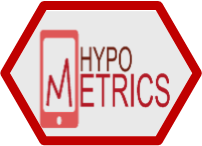

```{r, include = FALSE}
knitr::opts_chunk$set(
  collapse = TRUE,
  comment = "#>"
)
```


---
output: rmarkdown::html_vignette
vignette: >
  %\VignetteIndexEntry{Physical Activity and Sleep Data}
  %\VignetteEngine{knitr::rmarkdown}
  %\VignetteEncoding{UTF-8}
---

<style>
.nobullet li{
  list-style-type: none;
}
</style>




## Introduction

The `hypometrics` package was built to handle physical activity and sleep data generated by the FitBit Charge 4. Future work will consist of augmenting the package's adaptability in order to read in data from different Fitbit devices or other activity and sleep trackers (e.g. Garmin).

## Data Cleaning

## Data Checking

## Data Visualising

## Data Linking


